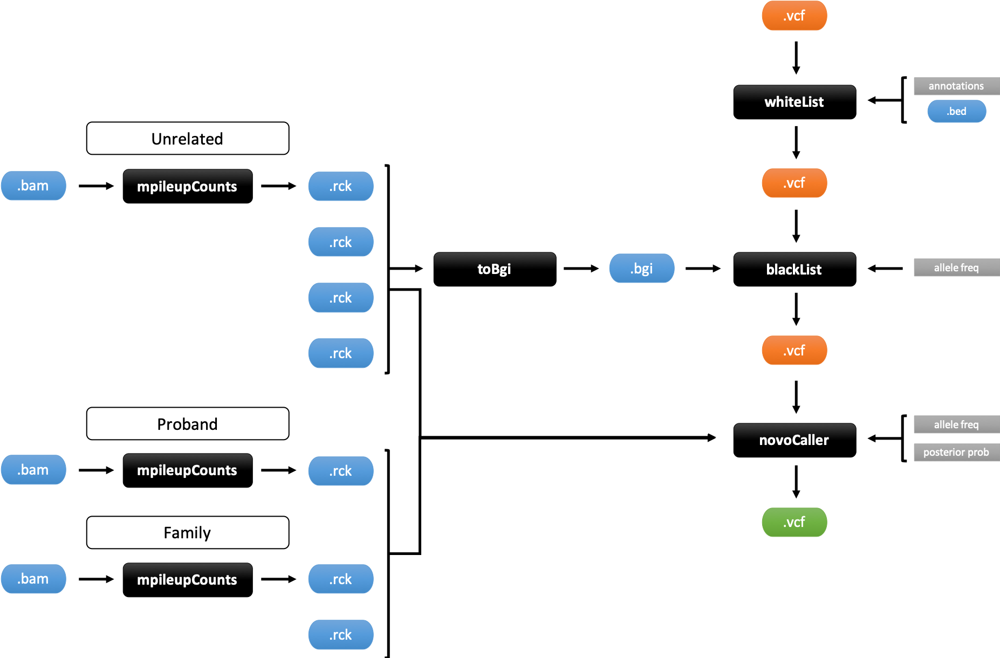

# granite
granite (*genomic variants filtering utilities*) is a collection of software to call, filter and work with genomic variants.

    usage: granite [-h] {novoCaller, mpileupCounts, blackList, whiteList, toBgi} ...

    positional arguments:
        novoCaller          Bayesian de novo variant caller
        mpileupCounts       samtools wrapper to calculate reads statistics for
                            pileup at each position
        blackList           utility to blacklist and filter out variants from
                            input VCF file based on positions set in BGI format
                            file and/or population allele frequency
        whiteList           utility to whitelist and select a subset of variants
                            from input VCF file based on specified annotations and
                            positions
        toBgi               utility that converts counts from bgzip and tabix
                            indexed RCK format into BGI format. Positions are
                            "called" by reads counts or allelic balance for single
                            or multiple files (joint calls) in specified regions

## Requirements
A ready-to-use docker image is available to download.

    docker pull IMAGE

To run locally Python (3.x) is required together with the following libraries:

  - [*numpy*](https://docs.scipy.org/doc/ "numpy documentation")
  - [*pysam*](https://pysam.readthedocs.io/en/latest/ "pysam documentation")
  - [*bitarray*](https://pypi.org/project/bitarray/ "bitarray documentation")
  - [*pytabix*](https://pypi.org/project/pytabix/ "pytabix documentation")
  - [*h5py*](https://www.h5py.org/ "h5py documentation")

To install with pip:

    pip install numpy pysam bitarray h5py
    pip install --user pytabix

Additional software needs to be available in the environment:

  - [*samtools*](http://www.htslib.org/ "samtools documentation")
  - [*bgzip*](http://www.htslib.org/doc/bgzip.1.html "bgzip documentation")
  - [*tabix*](http://www.htslib.org/doc/tabix.1.html "tabix documentation")

## File formats
The program is compatible with standard BED, BAM and VCF formats (VCFv4.x).

### ReadCountKeeper (.rck)
RCK is a tabular format that allows to efficiently store counts by strand (ForWard-ReVerse) for reads that support REFerence allele, ALTernate alleles, INSertions or DELetions at CHRomosome and POSition. RCK files can be further compressed with *bgzip* and indexed with *tabix* for storage, portability and faster random access. 1-based.

Tabular format structure:

    #CHR   POS   COVERAGE   REF_FW   REF_RV   ALT_FW   ALT_RV   INS_FW   INS_RV   DEL_FW   DEL_REV
    13     1     23         0        0        11       12       0        0        0        0
    13     2     35         18       15       1        1        0        0        0        0

Commands to compress and index files:

    bgzip PATH/TO/FILE
    tabix -b 2 -s 1 -e 0 -c "#" PATH/TO/FILE.gz

### BinaryGenomeIndex (.bgi)
BGI is a hdf5-based binary format that stores boolean values for each genomic position as bit arrays. Each position is represented in three complementary arrays that account for SNVs (Single-Nucleotide Variants), insertions and deletions respectively. 1-based.

hdf5 format structure:

    e.g.
    chr1_snv: array(bool)
    chr1_ins: array(bool)
    chr1_del: array(bool)
    chr2_snv: array(bool)
    ...
    ...
    chrM_del: array(bool)

*note*: hdf5 keys are build as the chromosome ID based on reference (e.g. chr1) plus the suffix specifing whether the array represents SNVs (_snv), insertions (_ins) or deletions (_del).

# Callers

## novoCaller
novoCaller is a Bayesian variant calling algorithm for *de novo* mutations. The model uses read-level information both in pedigree (trio) and unrelated samples to rank and assign a probabilty to each call. The software represents an updated and improved implementation of the original algorithm described in [paper](https://academic.oup.com/bioinformatics/advance-article/doi/10.1093/bioinformatics/bty749/5087716).

### Arguments
    usage: granite novoCaller [-h] -i INPUTFILE -o OUTPUTFILE -u UNRELATEDFILES -t
                              TRIOFILES [--ppthr PPTHR] [--afthr AFTHR]
                              [--aftag AFTAG] [--bam] [--MQthr MQTHR]
                              [--BQthr BQTHR]

    optional arguments:
      -i INPUTFILE, --inputfile INPUTFILE
                            input VCF file
      -o OUTPUTFILE, --outputfile OUTPUTFILE
                            output file to write results as VCF, use .vcf as
                            extension
      -u UNRELATEDFILES, --unrelatedfiles UNRELATEDFILES
                            TSV file containing ID<TAB>Path/to/file for unrelated
                            files used to train the model (BAM or bgzip and tabix
                            indexed RCK)
      -t TRIOFILES, --triofiles TRIOFILES
                            TSV file containing ID<TAB>Path/to/file for family
                            files, the PROBAND must be listed as LAST (BAM or
                            bgzip and tabix indexed RCK)
      --ppthr PPTHR         threshold to filter by posterior probabilty for de
                            novo calls (>=) [0]
      --afthr AFTHR         threshold to filter by population allele frequency
                            (<=) [1]
      --aftag AFTAG         TAG (TAG=<float>) to be used to filter by population
                            allele frequency [novoAF]
      --bam                 by default the program expect bgzip and tabix indexed
                            RCK files for "--triofiles" and "--unrelatedfiles",
                            add this flag if files are in BAM format instead
                            (SLOWER)
      --MQthr MQTHR         (only with "--bam") minimum mapping quality for an
                            alignment to be used (>=) [0]
      --BQthr BQTHR         (only with "--bam") minimum base quality for a base to
                            be considered (>=) [0]

### Input
novoCaller accepts files in VCF format as input. Files must contain genotype information for trio in addition to standard VCF columns. Columns IDs for trio must match the IDs provided together with the list of RCK/BAM files ("--triofiles").

Required VCF format structure:

    #CHROM   POS   ID   REF   ALT   QUAL   FILTER   INFO   FORMAT   PROBAND_ID   MOTHER_ID   FATHER_ID   ...

### Trio and unrelated files
By default novoCaller expect bgzip and tabix indexed RCK files. To use BAM files directly specify "--bam" flag.

*note*: using BAM files directly will significantly slow down the software since pileup counts need to be calculated on the spot at each position and for each bam.

### Output
novoCaller generates output in VCF format. Two new tags are used to report additional information for each call. *RSTR* stores reads counts by strand at position for reference and alternate allele. *novoCaller* stores posterior probabilty calculated for the call and allele frequency for alternate allele in unrelated samples.

*RSTR* tag definition:

    ##FORMAT=<ID=RSTR,Number=4,Type=Integer,Description="Reference and alternate allele read counts by strand (Rf,Af,Rr,Ar)">

*novoCaller* tag definition:

    ##INFO=<ID=novoCaller,Number=2,Type=Float,Description="Statistics from novoCaller. Format:'Post_prob|AF_unrel'">

#### Examples
Calls *de novo* variants. This will return the calls ranked and sorted by calculated posterior probabilty.

    granite novoCaller -i file.vcf -o file.out.vcf -u file.unrelatedfiles -t file.triofiles

It is possible to filter-out variants with posterior probabilty lower than "--ppthr".

    granite novoCaller -i file.vcf -o file.out.vcf -u file.unrelatedfiles -t file.triofiles --ppthr <float>

It is possible to filter-out variants with population allele frequency higher than "--afthr". Allele frequency must be provided for each variant in INFO column following the format tag=<float>. If "--aftag"
is not specified the program will search for *novoAF* tag as a default.

    granite novoCaller -i file.vcf -o file.out.vcf -u file.unrelatedfiles -t file.triofiles --afthr <float> --aftag tag

Filters can be combined.

    granite novoCaller -i file.vcf -o file.out.vcf -u file.unrelatedfiles -t file.triofiles --afthr <float> --aftag tag --ppthr <float>

# Utilities

## blackList
blackList allows to filter-out variants from input VCF file based on positions set in BGI format file and/or provided population allele frequency.

### Arguments
    usage: granite blackList [-h] -i INPUTFILE -o OUTPUTFILE [-b BGIFILE]
                             [--aftag AFTAG] [--afthr AFTHR]

    optional arguments:
      -i INPUTFILE, --inputfile INPUTFILE
                            input VCF file
      -o OUTPUTFILE, --outputfile OUTPUTFILE
                            output file to write results as VCF, use .vcf as
                            extension
      -b BGIFILE, --bgifile BGIFILE
                            BGI format file with positions set for blacklist
      --aftag AFTAG         TAG (TAG=<float>) to be used to filter by population
                            allele frequency
      --afthr AFTHR         threshold to filter by population allele frequency
                            (<=) [1]

#### Examples
Blacklist variants based on position set to "True" in BGI format file.

    granite blackList -i file.vcf -o file.out.vcf -b file.bgi

Blacklist variants based on population allele frequency. This filters out variants with allele frequency higher than "--afthr". Allele frequency must be provided for each variant in INFO column following the format tag=<float>.

    granite blackList -i file.vcf -o file.out.vcf --afthr <float> --aftag tag

Combine the two filter.

    granite blackList -i file.vcf -o file.out.vcf --afthr <float> --aftag tag -b file.bgi

## whiteList
whiteList allows to select and filter-in a subset of variants from input VCF file based on specified annotations and positions. The software can use provided VEP, CLINVAR or SpliceAI annotations. Positions can be also specfied as a BED format file.

### Arguments
    usage: granite whiteList [-h] -i INPUTFILE -o OUTPUTFILE [--SpliceAI SPLICEAI]
                             [--CLINVAR] [--VEP]
                             [--VEPrescue VEPRESCUE [VEPRESCUE ...]]
                             [--VEPremove VEPREMOVE [VEPREMOVE ...]]

    optional arguments:
      -i INPUTFILE, --inputfile INPUTFILE
                            input VCF file
      -o OUTPUTFILE, --outputfile OUTPUTFILE
                            output file to write results as VCF, use .vcf as
                            extension
      --SpliceAI SPLICEAI   threshold to whitelist variants by SpliceAI value (>=)
      --CLINVAR             flag to whitelist variants with a CLINVAR Id
      --VEP                 use VEP "Consequence" annotations to whitelist exonic and
                            functional relevant variants (removed by default variants
                            flagged as "intron_variant", "intergenic_variant",
                            "downstream_gene_variant", "upstream_gene_variant" or
                            "regulatory_region_variant")
      --VEPrescue VEPRESCUE [VEPRESCUE ...]
                            additional terms to overrule removed flags and/or to
                            rescue and whitelist variants when in combination in
                            the format annot&annot (e.g.
                            intron_variant&splice_region_variant)
      --VEPremove VEPREMOVE [VEPREMOVE ...]
                            additional terms to be removed
      --BEDfile BEDFILE     BED format file with positions to whitelist

#### Examples
Whitelists variants with CLINVAR ID. If available, CLINVAR annotation must be provided in INFO column.

    granite whiteList -i file.vcf -o file.out.vcf --CLINVAR

Whitelists variants based on SpliceAI annotations. This filters in variants with SpliceAI score equal/higher than "--SpliceAI". If available SpliceAI annotation must be provided in INFO column.

    granite whiteList -i file.vcf -o file.out.vcf --SpliceAI <float>

Whitelists variants based on VEP "Consequence" annotations. This withelists exonic and functional relevant variants by removing variants flagged as "intron_variant", "intergenic_variant", "downstream_gene_variant", "upstream_gene_variant" or "regulatory_region_variant". It is possible to specify additional terms to remove using "--VEPremove" and/or additional terms to rescue using "--VEPrescue". To use VEP, annotation must be provided for each variant in INFO column.

    granite whiteList -i file.vcf -o file.out.vcf --VEP
    granite whiteList -i file.vcf -o file.out.vcf --VEP --VEPremove <str> <str>
    granite whiteList -i file.vcf -o file.out.vcf --VEP --VEPrescue <str> <str>
    granite whiteList -i file.vcf -o file.out.vcf --VEP --VEPrescue <str> <str> --VEPremove <str>

Whitelists variants based on positions specified as a BED format file.

    granite whiteList -i file.vcf -o file.out.vcf --BEDfile file.bed

Combine the above filters.

    granite whiteList -i file.vcf -o file.out.vcf --BEDfile file.bed --VEP --VEPrescue <str> <str> --CLINVAR --SpliceAI <float>

## mpileupCounts
mpileupCounts uses *samtools* to access input BAM and calculates statistics for reads pileup at each position in the specified region, returns counts in RCK format.

### Arguments
    usage: granite mpileupCounts [-h] -i INPUTFILE -o OUTPUTFILE -r REFERENCE
                                 [--region REGION] [--MQthr MQTHR] [--BQthr BQTHR]

    optional arguments:
      -i INPUTFILE, --inputfile INPUTFILE
                            input file in BAM format
      -o OUTPUTFILE, --outputfile OUTPUTFILE
                            output file to write results as RCK format (TSV), use
                            .rck as extension
      -r REFERENCE, --reference REFERENCE
                            reference file in FASTA format
      --region REGION       region to be analyzed [e.g. chr1:1-10000000,
                            1:1-10000000, chr1, 1], chromosome name must match the
                            reference
      --MQthr MQTHR         minimum mapping quality for an alignment to be used
                            (>=) [0]
      --BQthr BQTHR         minimum base quality for a base to be considered (>=)
                            [13]

## toBgi
toBgi converts counts from bgzip and tabix indexed RCK format into BGI format. Positions are "called" by reads counts or allelic balance for single or multiple files (joint calls) in specified regions. Positions "called" are set to True (or 1) in BGI binary structure.

### Arguments
    usage: granite toBgi [-h] [-i INPUTFILE [INPUTFILE ...]] -o OUTPUTFILE -r
                         REGIONFILE -f CHROMFILE [--ncores NCORES] --fithr FITHR
                         [--rdthr RDTHR] [--abthr ABTHR]

    optional arguments:
      -i INPUTFILE [INPUTFILE ...], --inputfiles INPUTFILE [INPUTFILE ...]
                            list of files to be used for the single/joint calling
                            [e.g. -i file_1 file_2 ...], expected bgzip and tabix
                            indexed RCK files
      -o OUTPUTFILE, --outputfile OUTPUTFILE
                            output file to write results as BGI format (binary
                            hdf5), use .bgi as extension
      -r REGIONFILE, --regionfile REGIONFILE
                            file containing regions to be used [e.g.
                            chr1:1-10000000, 1:1-10000000, chr1, 1] listed as a
                            column, chromosomes names must match the reference
      -f CHROMFILE, --chromfile CHROMFILE
                            chrom.sizes file containing chromosomes size
                            information
      --ncores NCORES       number of cores to be used if multiple regions are
                            specified [1]
      --fithr FITHR         minimum number of files with at least "--rdthr" for
                            the alternate allele or having the variant, "calls" by
                            allelic balance, to jointly "call" position (>=)
      --rdthr RDTHR         minimum number of alternate reads to count the file in
                            "--fithr", if not specified "calls" are made by
                            allelic balance (>=)
      --abthr ABTHR         minimum percentage of alternate reads compared to
                            reference reads to count the file in "--fithr" when
                            "calling" by allelic balance (>=) [15]

#### Examples
toBgi can be used to calculate positions to blacklist for common variants by using unrelated samples. This command will set to "True" in BGI structure positions with allelic balance for alternate allele equal/higher than "--abthr" in more that "--fithr" samples (joint calling).

    granite toBgi -i file file file file ... -o file.out.bgi -f file.chrom.sizes -r file.regions --fithr <int> --abthr <int>

Absolute reads count can be used instead of allelic balance to call positions. This command will set to "True" in BGI structure positions with reads count for alternate allele equal/higher than "--rdthr" in more that "--fithr" samples (joint calling).

    granite toBgi -i file file file file ... -o file.out.bgi -f file.chrom.sizes -r file.regions --fithr <int> --rdthr <int>
