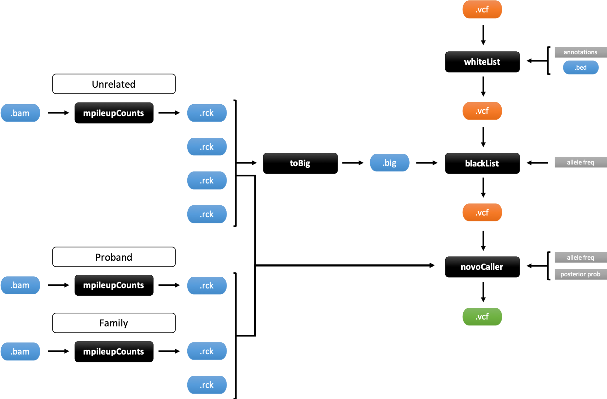

.. granite documentation master file, created by
   sphinx-quickstart on Thu Aug  6 10:40:44 2020.
   You can adapt this file completely to your liking, but it should at least
   contain the root `toctree` directive.

granite
===================================

granite is a collection of software to call, filter and work with genomic variants

.. toctree::
   :maxdepth: 1
   :caption: Contents:

   install
   fileformats
   novocaller
   comhet
   whitelist
   blacklist
   cleanvcf
   qcvcf
   mpileupcounts
   tobig
   rcktar
